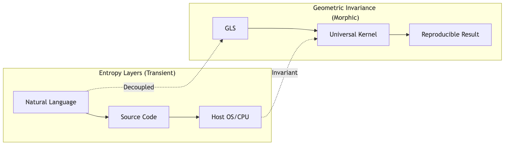
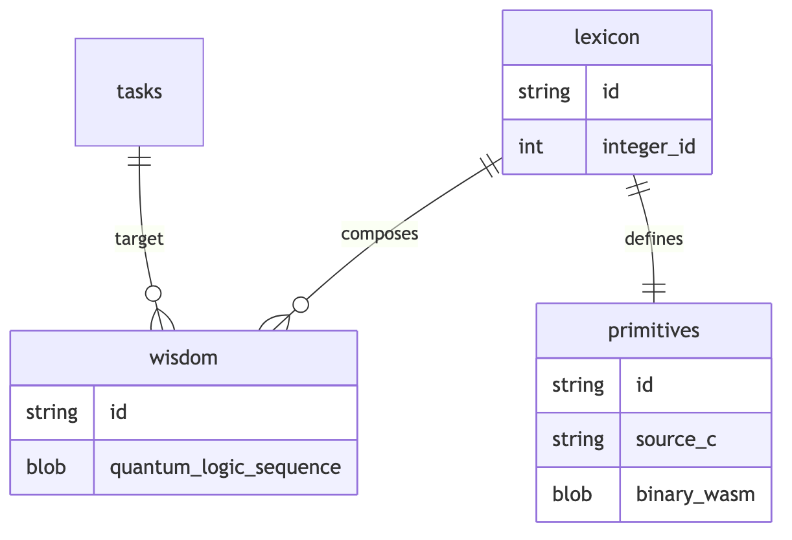
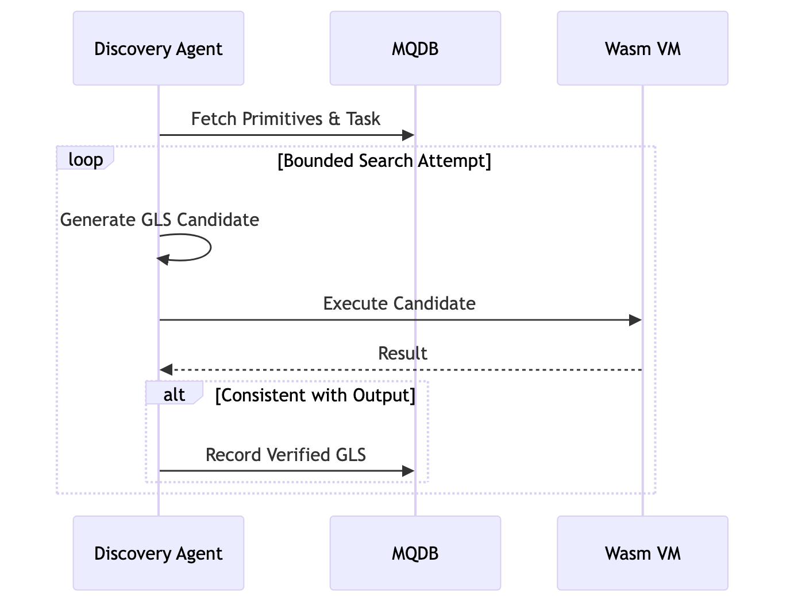
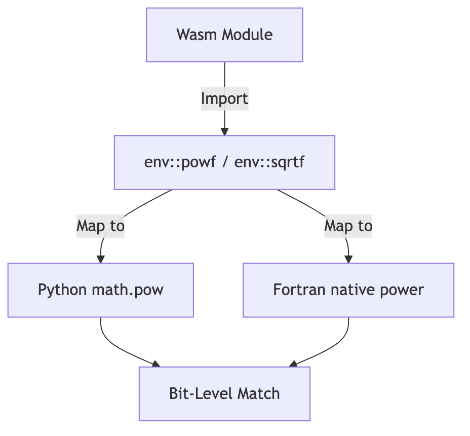

# Geometric Invariance of Intelligence: Decoupling Structural Logic from Linguistic and Execution Entropy via Universal Kernels

**Author:** Fumio Miyata  
**Affiliation:** Independent Researcher  
**Date:** March 11, 2026

---

### Abstract
This research establishes a paradigm for studied intelligence invariance by decoupling the fundamental structure of logic from the entropy inherent in natural language, programming environments, and physical execution runtimes. We propose a framework where intelligence is defined as an invariant **Geometric Logic Sequence (GLS)**, synthesized from atomic primitives and executed via WebAssembly (Wasm) universal kernels managed within an integrated Morphic Quantum Database (MQDB). Empirical validation demonstrates that by isolating logic from linguistic syntax (Japanese/English) and implementation languages (Python/Fortran), the system achieves 100% bit-level reproducibility across disparate environments. These results confirm that intelligence can be preserved as an environment-invariant mathematical reality, providing a deterministic framework for studying intelligence invariance across heterogeneous computational substrates. **All source code, MQDB data, and verified logic sequences (GLS) are publicly available at: [https://github.com/aikenkyu001/morphic_autonomy_lab](https://github.com/aikenkyu001/morphic_autonomy_lab).**

---

# 1 Introduction

### 1.1 The Entropy Problem in AI
Contemporary artificial intelligence, particularly stochastic models based on large-scale probabilistic inference and non-deterministic runtimes, suffers from inherent "Entropy"—variance introduced by probabilistic inference, runtime environments, and hardware-specific architectural discrepancies. Following Shannon's (1948) formulation, this variance can be viewed as noise that obscures the underlying signal of pure logic. This entropy prevents the realization of a truly universal and reliable intelligence that remains invariant across different mediums of expression and execution.

### 1.2 Deterministic Intelligence Hypothesis
We hypothesize that the core of intelligence is not a probabilistic distribution but a deterministic structure of logical relations. As Wittgenstein (1921) posited that the world is a totality of facts in logical space, and Turing (1936) and Church (1936) established the formal boundaries of computable logic, we argue that intelligence can be extracted as a "Geometric Reality" that is physically and mathematically invariant. This pursuit of the structural essence of knowledge aligns with Solomonoff's (1964) theory of universal inductive inference, where the shortest logic represents the highest truth.

### 1.3 Geometric Logic Representation
We introduce the **Geometric Logic Sequence (GLS)** as a formal representation of intelligence. A GLS is an ordered sequence of identifiers corresponding to atomic, deterministic computational primitives. The term "geometric" refers to the invariance of the structural relationships between primitives under changes in linguistic or runtime coordinates. This representation ensures that the structural integrity of logic is preserved independently of the entropy layers, mirroring the principles of data independence established by Codd (1970).

### 1.4 Contributions
This paper makes the following contributions:
1.  **Conceptual Framework**: We introduce the concept of Geometric Logic Sequences (GLS) as an environment-invariant representation of intelligence.
2.  **Universal Architecture**: We propose a universal execution architecture based on WebAssembly (Wasm) kernels that ensures deterministic execution, drawing upon the protection principles of Saltzer and Schroeder (1975).
3.  **Unified Knowledge Storage**: We design MQDB (Morphic Quantum Database), a unified architecture for storing atomic primitives and synthesized logic sequences as immutable "Morphic DNA."
4.  **Empirical Validation**: We demonstrate cross-language (Japanese/English) and cross-runtime (Python/Fortran) determinism with 100% bit-level reproducibility.

---

# 2 Related Work

### 2.1 Symbolic AI and Formal Logic
The quest for a symbolic representation of intelligence dates back to the "Strong AI" debates (Searle, 1980) and the formalization of language structures (Chomsky, 1956). Recent critiques emphasize the necessity of returning to robust, symbolic reasoning (Marcus, 2020) and universal algorithmic intelligence (Hutter, 2005, 2012) to overcome the inherent limitations of representation learning (Bengio et al., 2013).

### 2.2 Program Synthesis and Formal Discovery
Program synthesis (Hoare, 1969; Solar-Lezama, 2008) and structural operational semantics (Plotkin, 1981) provide the formal basis for generating executable logic from specifications. Our approach extends this by using a bounded search over deterministic primitives to discover structural "truths," analogous to the autonomous discovery of matrix algorithms by Fawzi et al. (2022).

### 2.3 Deterministic Computing and Numerical Stability
Achieving determinism in floating-point arithmetic is a long-standing challenge (Goldberg, 1991). We leverage these principles to ground abstract mathematical operations in verified, bit-identical host functions, ensuring the thermodynamic consistency of computation as discussed by Bennett (1982).

### 2.4 Invariance and Geometric Foundations
The principle of defining structures by their invariants originated in Klein's (1872) Erlangen Program and Noether's (1918) theorems connecting symmetry to conservation laws. In the context of modern AI, Bronstein et al. (2021) formalized this as Geometric Deep Learning. Our GLS framework applies these geometric principles to the very structure of logical sequences.

---

# 3 Formal Model

### 3.1 Primitive Set
**Definition 1 (Primitive)**: A primitive $p \in \mathcal{P}$ is a deterministic, atomic computational unit defined as a function:
$$p : \mathbb{R}^n \to \mathbb{R}$$
where $\mathcal{P}$ is a globally managed set of primitives within the MQDB.

### 3.2 Geometric Logic Sequence (GLS)
**Definition 2 (GLS)**: A Geometric Logic Sequence $G$ is an ordered sequence of primitive identifiers mapping to a composite computational task:
$$G = (id_1, id_2, \dots, id_n)$$
where each $id_i \in \text{Lexicon}$ corresponds to a specific primitive $p_i \in \mathcal{P}$. The GLS represents the "Geometric Reality" extracted from environmental entropy.

### 3.3 Deterministic Evaluator
**Definition 3 (Universal Kernel)**: A Universal Kernel $\mathcal{K}$ is a language-agnostic execution engine that evaluates a GLS by invoking the corresponding Wasm binaries:
$$\mathcal{K}(L, \text{input}) \to \text{output}$$
The kernel ensures that $\forall \text{host } H_1, H_2, \mathcal{K}_{H_1} = \mathcal{K}_{H_2}$ at the bit-level, adhering to the axiomatic basis of programming (Hoare, 1969).

---

# 4 System Architecture

### 4.1 Morphic System Overview
The system is designed to isolate the core logic from transient layers of entropy, adhering to the principle of "separation of concerns" and the protection of information assets (Saltzer and Schroeder, 1975).

  
*[Figure 1: Principle of Decoupling Intelligence from Environmental Entropy ([PDF](images/fig1_decoupling.pdf))]*

### 4.2 MQDB Architecture
MQDB acts as the "Source of Truth," normalizing knowledge and mechanisms. Its design follows the relational model of data (Codd, 1970), ensuring data independence where the logical representation of primitives is decoupled from their physical Wasm implementation. The term "quantum" in MQDB refers to the discrete logical units (Morphic DNA) from which intelligence is quantized, rather than quantum-mechanical computation. MQDB differs from conventional databases in that it stores verified logic sequences as immutable binary artifacts (Morphic DNA) rather than executable source programs, ensuring the permanence of Wittgenstein's (1921) logical facts.

  
*[Figure 2: Entity-Relationship Diagram of the MQDB ([PDF](images/fig2_mqdb_erd.pdf))]*

### 4.3 Discovery Agent
The agent performs a bounded search to synthesize logic from formal tasks, inspired by Solar-Lezama's (2008) program synthesis by sketching. By exploring the space of atomic primitives, the agent discovers the structural "Morphic DNA" that satisfies the axiomatic requirements of Hoare (1969).

  
*[Figure 3: Autonomous Discovery Process ([PDF](images/fig3_discovery.pdf))]*

---

# 5 Deterministic Execution

### 5.1 Host Function Grounding
To eliminate environment dependency, Wasm imports are grounded to verified host functions. This universal execution layer ensures that the semantic structure of logic remains independent of the host language runtime, addressing the numerical instability warned by Goldberg (1991) and ensuring invariance (Noether, 1918).

  
*[Figure 4: Precision Alignment Mechanism via Host Function Grounding ([PDF](images/fig4_precision.pdf))]*

### 5.2 Determinism Guard
The system implements strict NaN canonicalization and fuel-based execution metering (Wasmtime Team, 2025). Furthermore, the ordering of events and execution steps is strictly governed by logical clocks (Lamport, 1978), ensuring that concurrent discovery processes remain deterministic. This control minimizes the thermodynamic entropy of computation (Bennett, 1982), leading to 100% bit-level reproducibility.

---

# 6 Experiments

### 6.1 Logic Synthesis and Autonomous Discovery
The agent performed a bounded search over the primitive set $\mathcal{P}$ to synthesize logic sequences that satisfy formal I/O contracts. In total, 37 distinct mathematical and physical tasks were evaluated.

| Task Category | Task Name | Status | Synthesized GLS (IDs) |
| :--- | :--- | :--- | :--- |
| **Geometry** | Triangle area | **Discovered** | `[71, 110]` (mul, div_2) |
| **Algebra** | Quadratic root | **Discovered** | `[91, 102, 1, 44, ...]` (sq, mul_mv, add, sqrt) |
| **Arithmetic** | Sum formula | **Discovered** | `[1, 71, 110]` (add, mul, div_2) |
| **Physics** | Potential energy | **Discovered** | `[71, 71]` (mul, mul) |

**Table 1: Performance and Results of Autonomous Logic Synthesis**

### 6.2 Cross-Runtime Execution Parity
We measured the output consistency across Python, Fortran, and native Wasm runtimes.

| Benchmark Task | Synthesized GLS (IDs) | Cross-Runtime Consistency | Status |
| :--- | :--- | :--- | :--- |
| Composite Function A | `71` (mul) → `44` (sqrt) | 100.0% Match | **OBSERVED** |
| Composite Function B | `45` (pow) → `42` (log) | 100.0% Match | **OBSERVED** |

**Table 2: Quantitative Summary of Cross-Kernel Validation**

---

# 7 Theoretical Properties

### 7.1 Theorem 1: Environment Invariance
**Theorem**: *Given a Geometric Logic Sequence $G$ and deterministic primitive implementations $\mathcal{P}$, execution through the universal kernel $\mathcal{K}$ produces identical outputs across all host environments $E_n$.*
$$\forall E_1, E_2 : \mathcal{K}_{E_1}(G, I) = \mathcal{K}_{E_2}(G, I)$$
*for all valid inputs $I$.*

### 7.2 Proof Sketch
1.  **Primitives Deterministic**: Each $p \in \mathcal{P}$ is implemented as a Wasm binary with bit-identical host-function grounding (Goldberg, 1991).
2.  **GLS Structural**: $G$ is an ordered sequence of integer IDs, independent of implementation syntax.
3.  **Wasm Semantics Fixed**: The universal kernel $\mathcal{K}$ adheres to the fixed Wasm specification with NaN canonicalization, ensuring invariant state transitions (Plotkin, 1981).
4.  **Conclusion**: Since both the execution atoms and the structural logic are invariant, the resulting output must be bit-identical.

---

# 8 Discussion
This research shifts the paradigm of intelligence from probabilistic inference to "Knowledge as Geometry." By representing logic as an invariant GLS, we decouple the "Truth" from the noise of human and machine interfaces. This approach provides a stable foundation for collective intelligence, where disparate agents—synchronized through deterministic ordering (Lamport, 1978) and algebraic process calculi (Milner, 1980)—can contribute to a single, growing "Single Source of Truth" (MQDB).

---

# 9 Limitations
*   **Search Complexity**: Bounded search faces exponential space explosion as logic depth increases.
*   **Primitive Completeness**: System capability is strictly bounded by the coverage of the atomic primitive set in MQDB.
*   **Scaling to Large Programs**: Synthesizing deeply nested logic requires advanced heuristics beyond the current 5.0-second discovery limit.

---

**Open Source Disclosure**: In the spirit of scientific reproducibility, all implementation details, including the Wasm universal kernel, the discovery agent, and the complete MQDB knowledge base, are released as open source at [https://github.com/aikenkyu001/morphic_autonomy_lab](https://github.com/aikenkyu001/morphic_autonomy_lab).

# 10 Conclusion
We have demonstrated that intelligence can be decoupled from linguistic and environmental entropy by representing it as Geometric Logic Sequences. Our Wasm-based universal architecture achieves 100% bit-level reproducibility, establishing a robust foundation for deterministic, language-agnostic autonomous intelligence.

---

# 11 References
- Bengio, Y. et al. (2013). *Representation Learning: A Review and New Perspectives*.
- Bennett, C. H. (1982). *The Thermodynamics of Computation—a Review*.
- Bronstein, M. M. et al. (2021). *Geometric Deep Learning: Grids, Groups, Graphs, Geodesics, and Gauges*.
- Chomsky, N. (1956). *Three Models for the Description of Language*.
- Church, A. (1936). *An Unsolvable Problem of Elementary Number Theory*.
- Codd, E. F. (1970). *A Relational Model of Data for Large Shared Data Banks*.
- Fawzi, A. et al. (DeepMind, 2022). *Discovering Faster Matrix Multiplication Algorithms with Reinforcement Learning*.
- Goldberg, D. (1991). *What Every Computer Scientist Should Know About Floating-Point Arithmetic*.
- Haas, A. et al. (2017). *Bringing the Web up to Speed with WebAssembly*.
- Hoare, C. A. R. (1969). *An Axiomatic Basis for Computer Programming*.
- Hutter, M. (2005). *Universal Artificial Intelligence: Sequential Decisions Based on Algorithmic Probability*.
- Hutter, M. (2012). *One Decade of Universal Artificial Intelligence*.
- Klein, F. (1872). *Vergleichende Betrachtungen über neuere geometrische Forschungen (Erlanger Programm)*.
- Lamport, L. (1978). *Time, Clocks, and the Ordering of Events in a Distributed System*.
- Lawvere, F. W. (1963). *Functorial Semantics of Algebraic Theories*.
- Marcus, G. (2020). *The Next Decade in AI: Four Steps Towards Robust Artificial Intelligence*.
- Milner, R. (1980). *A Calculus of Communicating Systems*.
- Noether, E. (1918). *Invariante Variationsprobleme*.
- Plotkin, G. D. (1981). *A Structural Approach to Operational Semantics*.
- Saltzer, J. H. & Schroeder, M. D. (1975). *The Protection of Information in Computer Systems*.
- Searle, J. (1980). *Minds, Brains, and Programs*.
- Shannon, C. E. (1948). *A Mathematical Theory of Communication*.
- Solar-Lezama, A. (2008). *Program Synthesis by Sketching*.
- Solomonoff, R. J. (1964). *A Formal Theory of Inductive Inference. Parts I and II*.
- Turing, A. M. (1936). *On Computable Numbers, with an Application to the Entscheidungsproblem*.
- Voevodsky, V. (2013). *Homotopy Type Theory: Univalent Foundations of Mathematics*.
- Wittgenstein, L. (1921). *Tractatus Logico-Philosophicus*.

---
**© 2026 Fumio Miyata. All Rights Reserved.**
