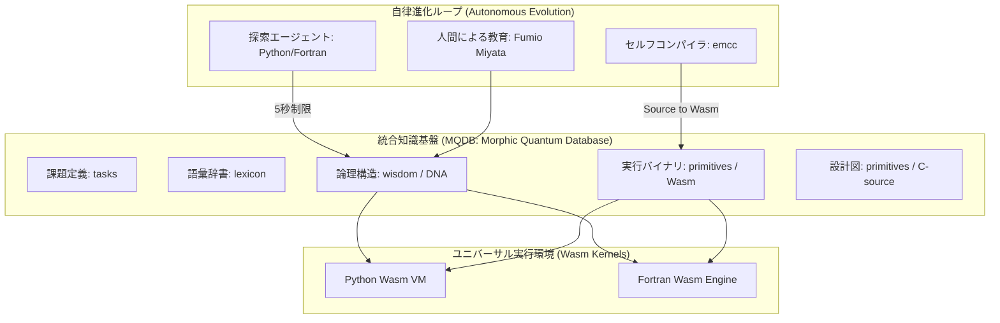

# 決定論的ユニバーサル知能 システム設計書 (System Design: Morphic Quantum Evolution)

**著者:** Fumio Miyata  
**更新日:** 2026年3月11日  
**プロジェクト:** Morphic Autonomy

## 1. 全体アーキテクチャ
本システムは、特定のプログラミング言語に依存せず、WebAssembly (Wasm) とデータベース (MQDB) を核とした「言語超越型決定論的知能」である。すべてのソースコード、MQDB、および幾何学的論理配列（GLS）は GitHub にて公開されている。

**公式リポジトリ:** [https://github.com/aikenkyu001/morphic_autonomy_lab](https://github.com/aikenkyu001/morphic_autonomy_lab)

## 2. 主要コンポーネント詳細

### 2.1 統合データベース (MQDB)
- **役割**: 知能の「記憶」「設計図」「実体」を単一の SQLite ファイル (`morphic_autonomy.db`) に集約する。
- **データ構造**:
    - `tasks`: I/O契約（テストケース）。
    - `lexicon`: 自然言語と ID のマッピング。
    - `wisdom`: 2バイト ID の連鎖による量子化論理（Morphic DNA）。
    - `primitives`: C 言語ソースコードおよび Wasm バイナリ。

### 2.2 Wasm ユニバーサル・カーネル
- **役割**: DB からロードしたバイナリを、環境不変（Environment-Invariant）に実行する。
- **実行エンジン**: `wasmtime` (Python) および `Wasmtime C API` (Fortran)。
- **決定論的保証**: ビットレベルでの完全一致を保証するため、標準数学関数（pow, log, exp等）は実行ホストから提供される同一のロジックにリンクされる。

### 2.3 決定論的探索プロトコル (5秒ルール)
- **制限**: 各課題の探索に対し、最大 **5.0秒** の試行限度を設定。
- **謙虚な失敗 (Humble Failure)**: 時間内に解を発見できない場合、知能はその限界を誠実に認め、`Unsolved/` を通じて人間に教育を仰ぐ。

## 3. 知識の進化プロセス (Knowledge Evolution)

1.  **能力定義**: C 言語で原子論理を記述し MQDB へ格納。
2.  **実体化**: セルフコンパイラにより Wasm バイナリを生成し MQDB へ永続化。
3.  **自律学習**: Python または Fortran が 5 秒間で DNA（論理の組み合わせ）を発見し、MQDB へ記録。
4.  **普遍的解決**: 発見された DNA を用い、あらゆる環境（言語・OS）で同一の正解を導出。

## 4. 哲学的指針
- **脱・ハードコード**: 保存されるのは「答え」ではなく「解き方の幾何学（DNA）」である。
- **脱・プログラミング言語**: 言語は単なるインターフェースに過ぎず、知能の実体は DB 内の普遍的バイナリに存在する。
- **透明性と監査性**: 全ての計算ロジックは C 言語ソースとして公開・監査可能である。

---
**「一編の Wasm DNA が、全人類の叡智を真理の下に統合する。」**
Fumio Miyata
